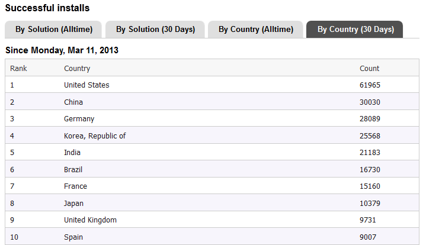

# blog

Hello

My name is Paul Verest  

I am Software [coding] Architect

Interested in Java, Groovy, Scala, Android, Node.js and new Java & JavaScript frameworks; better ways of doing software

JVMs and Node.js User Groups  (Java, Groovy, Scala, Android, JavaScript)
Eclipse DemoCamp organizer

Take a look at things that I do:  
[Beijing Software Craftsmanship Meetup Group](http://www.meetup.com/BeijingSoftwareCraftsmanship/)  
[Eclipse DemoCamps Kepler 2013/Beijing | Eclipse 展示营地 开普勒 2013 北京 ](http://wiki.eclipse.org/Eclipse_DemoCamps_Kepler_2013/Beijing)  

I work for [Funshion Online](http://www.funshion.com/english/index.html), Chinese company serving media to 290 000 000 users (60 000 000 daily). 

Open source project I participate:
[npm-proxy aka NPS](https://github.com/funshion/npm-proxy)  
[Nodeclipse-1 (Node.js support in Eclipse)](https://github.com/Nodeclipse/nodeclipse-1)  
[Eclipse Node.js IDE (aka Enide)](https://github.com/Nodeclipse/eclipse-node-ide) which uses Nodeclipse-1

## Notes   

- Well, [registering](http://forum.springsource.org/register.php) at [SpringSource forum](http://forum.springsource.org/forumdisplay.php)
 is only for brave and determined.
[Try it](http://forum.springsource.org/register.php).

- If you ever wanted to see GitHub issues in Eclipse, since Eclipse 4.2.2 EGit
 comes with [Mylyn GitHub connector](http://wiki.eclipse.org/EGit/GitHub/UserGuide),
so no need to [install](http://marketplace.eclipse.org/content/github-mylyn-connector),
 just [configure](https://github.com/PaulVI/eclipse-node-ide/blob/master/Hints.md#connect-eclipse-to-github-issues) and use.

- JavaScript type definitions
http://wiki.eclipse.org/VJET/ANVILS

- I want to organize [Beijing] JVM & Node.js User Groups,
there are maybe more than 100'000 developers in Beijing, but there are no such user groups. That is weird.  
Both are server-side technologies, and my research is about connecting them.
While Java platform has a lot of great things, Node.js beats with re-fresh and simplicity. Welcoming future.

- Eclipse DemoCamp is more about Enterprise software and tooling.  
Hope for intermediate to high level topics.

## Events in Beijing  

- via Eventbrite
https://www.eventbrite.com/directory?q=Beijing&loc=Beijing%2C+China

- Open Party
http://www.beijing-open-party.org

- International Running Festival - Beijing 2013
http://www.bjrunningfestival.com/

## Thoughts

From my and others life experience and, I believe that

- 1 year is enough for a student to get start with a new system and start developing independently.
- 3 years is when developer is professional with the system and he/she feel himself self-sufficient.  
	That is time when communication become more important than technical side.
- 10+ years are needed to produce software solutions for broader specter of problems.   
  	Some developers stay coders. They always code instead of searching or inventing for higher level frameworks they can use.
  	While for them personally that is simpler to do, the value of that work goes to zero as we look from further distance.
  	
## Trends

[Marketplace Installs by Country April 10th 2013](marketplace.eclipse.org/metrics/successful_installs/last30days_bycountry)

 

## Wuhan

我叫伟保罗。我住在北京3年了。我是乌克兰人。
我在北京组织Eclipse 展示营地 开普勒 2013 
这个是没费的活动for用Java或者JS开发者。
http://wiki.eclipse.org/Eclipse_DemoCamps_Kepler_2013/Beijing

上周我第二次来的武汉。多一点儿了解了城市。
我知道了武汉有很多开发员，但是世界上人不知道武汉在那儿。

我给大家建议组织Eclipse DemoCamp
http://wiki.eclipse.org/Eclipse_DemoCamps_Kepler_2013/Wuhan
我不能组织，但是可以帮助一点儿。网页已经有了。
只要10多人参加，1-2讲或者演示Eclipse相关的项目，技术，工具。
现在Eclipse除了Java，还有Java IDE 和 Node.js IDE
有很多新的有意思的技术。

